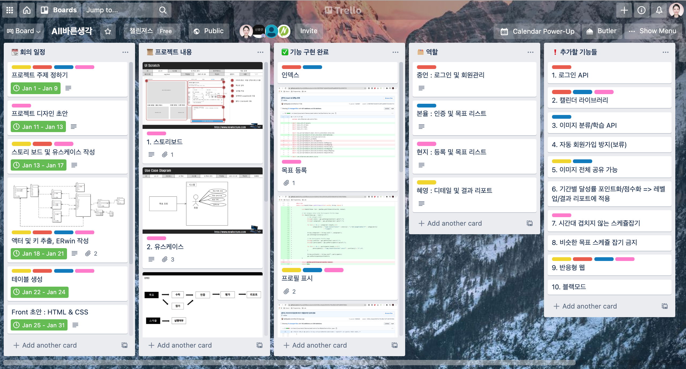

# 올바른생각
<p align="center">

</p>


## 📑 프로젝트 소개
- [x] 새해맞이 목표 달성 커뮤니티 사이트
- [x] 많은 사람들이 목표를 세우지만 목표 달성률은 8%에 그치는 문제를 돕고자 기획
- [x] 주요 기능1. 다양한 사람들과 구체적인 방법으로 공동 목표를 도전
- [x] 주요 기능2. 주기적인 인증을 통해 지속적인 행동을 할 수 있게 도와줌
- [x] 주요 기능3. 목표가 종료되면 내 결과 리포트로 발전을 확인할 수 있음


## 🛠 사용 기술
| Front-End      | Back-End       | DataBase | Tool                                       |
| -------------- | -------------- | -------- | ------------------------------------------ |
| HTML5<br>CSS3<br>JS ES6 | Mybatis<br>Spring | MySQL    | SpringBoot<br>Git<br>Trello<br>Kakao Oven<br>Photoshop |


## 📅 개발 기간


## 💼 설치
```
> git clone https://github.com/cyon13/AllBareun
```


## 📊 E-R Diagram


## 📖 Issues 관리



## 🎞 실행 화면

✅ [1] 회원가입


✅ [2] 로그인


✅ [3] 인덱스 페이지 : full calendar 라이브러리와 p5.js 라이브러리를 이용해서 달력기능과 눈 효과를 구현해서 구성했습니다.


✅ [4] 목표 탭 & 참가


✅ [5] 목표 개설 : 공개된 목표를 볼 수 있는 곳으로 스크롤에 따라 추가적으로 목표를 볼 수 있으며 검색 기능을 통해 원하는 목표를 찾아서 선택할 수 있습니다.


✅ [6] 초대 응답 : 개설된 목표에 참가할 수 있습니다. 참가 되면 내 목표 탭에서 목표를 확인할 수 있습니다.


✅ [7] 내 목표  : 목표 설정에 맞게 인증하는 날짜에 따라서 목표를 사진과 함께 인증할 수 있습니다. 드래그 앤 드롭으로 사진을 올릴 수 있으며 사진 수정이 가능합니다. 인증이 되면 각 목표의 디테일페이지에서 인증된 결과를 확인할 수 있습니다.


✅ [8] 인증 : 목표가 다 끝나면 달성도(80% 기준)에 따라 재도전을 선택할 수 있고 목표 기간동안 인증했던 내용들을 사진으로 볼 수 있으며 각자가 목표 기간동안 올려왔던 사진들을 동영상으로 볼 수 있도록 구현하였습니다. chart.js 를 이용하여 목표 달성도와 평가지 데이터를 기반으로 결과를 요약하여 나타내었습니다.


✅ [9] 디테일 : 목표가 다 끝나면 달성도(80% 기준)에 따라 재도전을 선택할 수 있고 목표 기간동안 인증했던 내용들을 사진으로 볼 수 있으며 각자가 목표 기간동안 올려왔던 사진들을 동영상으로 볼 수 있도록 구현하였습니다. chart.js 를 이용하여 목표 달성도와 평가지 데이터를 기반으로 결과를 요약하여 나타내었습니다.


✅ [10] 종합 리포트 : 목표가 다 끝나면 달성도(80% 기준)에 따라 재도전을 선택할 수 있고 목표 기간동안 인증했던 내용들을 사진으로 볼 수 있으며 각자가 목표 기간동안 올려왔던 사진들을 동영상으로 볼 수 있도록 구현하였습니다. chart.js 를 이용하여 목표 달성도와 평가지 데이터를 기반으로 결과를 요약하여 나타내었습니다.


✅ [11] 목표 리포트 : 목표가 다 끝나면 달성도(80% 기준)에 따라 재도전을 선택할 수 있고 목표 기간동안 인증했던 내용들을 사진으로 볼 수 있으며 각자가 목표 기간동안 올려왔던 사진들을 동영상으로 볼 수 있도록 구현하였습니다. chart.js 를 이용하여 목표 달성도와 평가지 데이터를 기반으로 결과를 요약하여 나타내었습니다.


✅ [12] 재도전 : 목표가 다 끝나면 달성도(80% 기준)에 따라 재도전을 선택할 수 있고 목표 기간동안 인증했던 내용들을 사진으로 볼 수 있으며 각자가 목표 기간동안 올려왔던 사진들을 동영상으로 볼 수 있도록 구현하였습니다. chart.js 를 이용하여 목표 달성도와 평가지 데이터를 기반으로 결과를 요약하여 나타내었습니다.


## 💻 개발자

 | <br>[신중언](https://github.com/Joong-eon)| <br>[구본율](https://github.com/cyon13) | <br>[김현지](https://github.com/iamhyunji) | <br>[임혜영](https://github.com/HYEYOUNGLIM) |
 | :---------------: | :---------------: | :---------------: | :---------------: |


## 기여
- [x] Front End
- [x] Back End


## 어려웠던 점
- [x] 학습하면서 프로젝트 진행을 하여 코드의 집중화에 어려움이 있었음
- [x] 처음 웹을 접하니 최대한 모든 기능을 직접 구현하는게 어려웠음
- [x] 테이블 정규화


## 느낀점
- [x] 팀프로젝트를 진행하며, 협업도구의 중요성을 깨달았음
- [x] 학습에 의의를 두어 관리인 페이지에만 집중했는데, 사용자 페이지도 보완하고 싶음
- [x] CRUD 구현 외에 다양한 기능들을 구현해보고 싶음